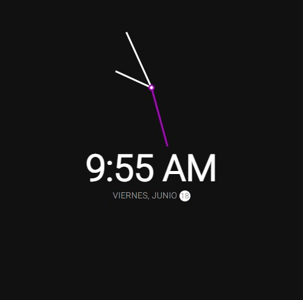

# Reloj con tema oscuro

`JavaScript y CSS`

## Vista principal 

[Ir a la Página](https://angry-dubinsky-e15ef4.netlify.app/)

### Código de Roración conforme al tiempo (Tomado de stackoverflow).
`const scale = (number, inMin, inMax, outMin, outMax) => {
	return (number - inMin) * (outMax - outMin) / (inMax - inMin) + outMin;
}
`